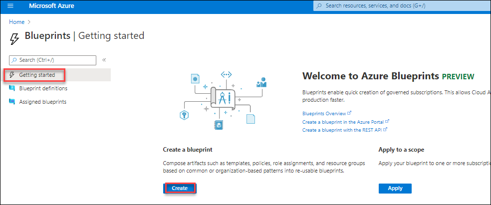
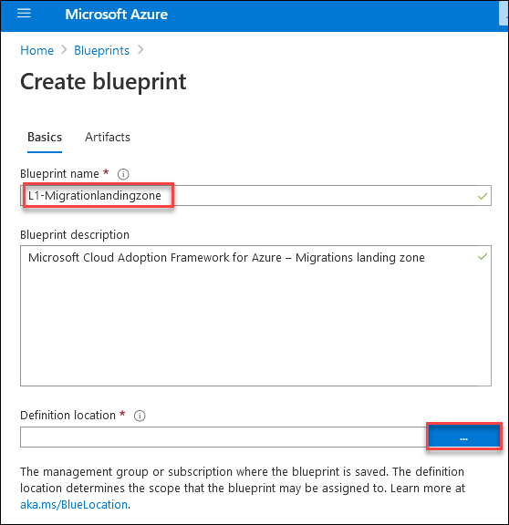

# Exercise 1: Start Small & Expand Migrate Landing Zone

## Context

Tailwind Traders is planning to migrate initial set of workloads from on-premises to cloud. They need a reference architecture to deploy and enforce resources, policies, and templates that will allow them to confidently get started with Azure.

In this exercise, you will create a blueprint definition based on CAF Migration Landing Zone and assign it at the subscription level to get start started with Azure. Also, you will update the blueprint to match DMS Network architecture of Tailwind Traders.

#### Task 1: Create a blueprint based on CAF Migration Landing Zone

In this task , you will create blueprint definition based on CAF Migration Landing Zone and also explore the capabilities it provides.

Blueprints enable quick creation of governed subscriptions. This allows Cloud Architects to design environments that comply with organizational standards and best practices – enabling your app teams to get to production faster. Using blueprints you can compose artifacts such as templates, policies, role assignments, and resource groups based on common or organization-based patterns into re-usable blueprints.

1. Once you are logged in to Azure portal ,search for **Blueprint** from the search bar at the top center position.
   
    
   
2. On the **Blueprints| Getting started** page, under the **Create a blueprint** header click on **Create** to start configuring the blueprint. 
    
    

3. Under the **Choose a  blueprint sample**, **Select** the already available blueprint sample **CAF Migration Landing zone**

    
 
4. On the **Create blueprint** page , Provide the following details:
   - Name : **L1MigrationLandingzone**
   - Blueprint description : Leave the default description
   
    
   
5. The definition location determines the **scope** that the blueprint may be assigned to, the management group or subscription where the blueprint is saved.
   - **Definition Location** : Select the **Subscription** named **L1- MigrationLZ Sub-Suffix**
   
6. Explore the artifacts included with the **CAF Migration Landing zone blueprint sample**

7. Click on **Save Draft** to save the blueprint cofnigurations.

