# Exercise 1: Start Small and Expand Migrate Landing Zone

## Context

Tailwind Traders is planning to migrate initial set of workloads from on-premises to cloud. They need a reference architecture to deploy and enforce resources, policies, and templates that will allow them to confidently get started with Azure.

In this exercise, you will create a blueprint definition based on **CAF Migration Landing Zone** and assign it at the subscription level to get start started with Azure. Also, you will update the blueprint to match DMS Network architecture of Tailwind Traders.

## Reference architecture

The Microsoft Cloud Adoption Framework for Azure **(CAF) Migration landing zone** blueprint is a set of infrastructure to help you set up for migrating your first workload and manage your cloud estate in alignment with CAF.

The CAF Migration landing zone blueprint sample deploys foundation infrastructure resources in Azure that can be used by organizations to prepare their subscription for migrating virtual machines in to. It also helps put in place the governance controls necessary to manage their cloud estate. This sample will deploy and enforce resources, policies, and templates that will allow an organization to confidently get started with Azure.

This environment is composed of several Azure services used to provide a secure, fully monitored, enterprise-ready governance.You will explore the resources deployed with this blueprint in further tasks.

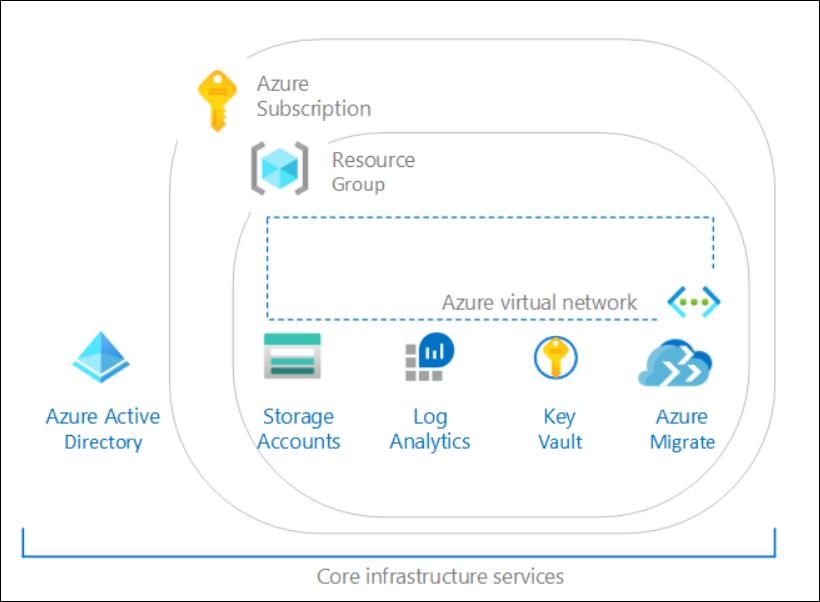 

#### Task 1: Deploy the Microsoft Cloud Adoption Framework for Azure migrate landing zone blueprint sample

In this task , you will create blueprint definition based on CAF Migration Landing Zone and also explore the capabilities it provides.

To deploy the Azure Blueprints CAF Migration landing zone blueprint sample, the following steps must be taken:

- Recommended to deploy the CAF Foundation blueprint sample
- Create a new blueprint from the sample
- Mark your copy of the sample as Published
- Assign your copy of the blueprint to an existing subscription

> Note: Blueprints enable quick creation of governed subscriptions. This allows Cloud Architects to design environments that comply with organizational standards and best practices – enabling your app teams to get to production faster. Using blueprints you can compose artifacts such as templates, policies, role assignments, and resource groups based on common or organization-based patterns into re-usable blueprints.

1. Once you are logged in to Azure portal ,search for **Blueprint** from the search bar at the top center position.
   
    
   
2. On the **Blueprints| Getting started** page, under the **Create a blueprint** header click on **Create** to start configuring the blueprint. 
    
    

3. Under the **Choose a  blueprint sample**, **Select** the already available blueprint sample **CAF Migration Landing zone**

   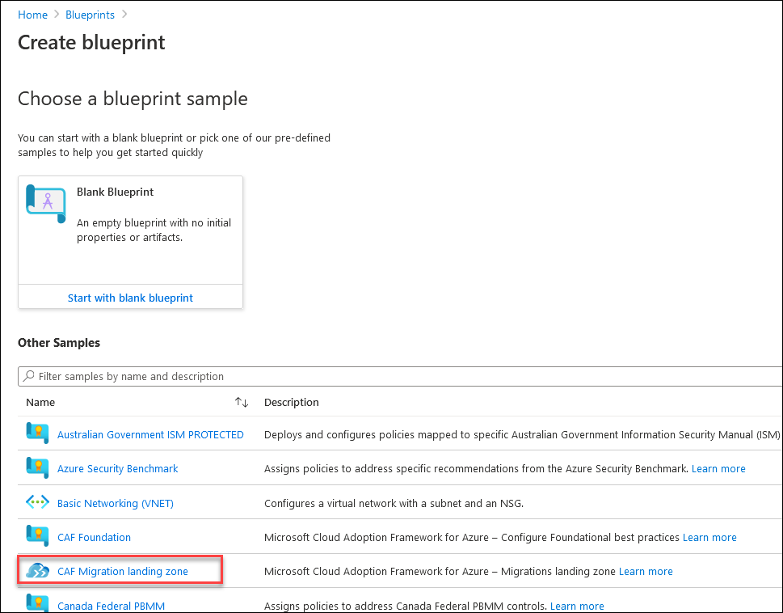 
 
4. On the **Create blueprint** page , Provide the following details:
   - Name : **L1MigrationLandingzone**
   - Blueprint description : Leave the default description
   - Definition location: Click on **...** symbol.
   
    
   
5. The definition location determines the **scope** that the blueprint may be assigned to, the management group or subscription where the blueprint is saved.
   - **Definition Location** : Select the **Subscription** named **L1- MigrationLZ Sub-Suffix**
   - Click on **Select** and return to the Create blueprint page
     
   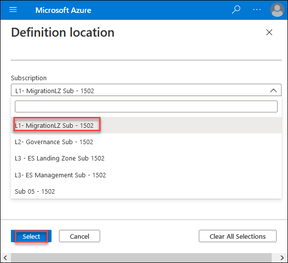 

6. Click on **Next:Artifacts>>** and explore the artifacts included along with the **CAF Migration Landing zone blueprint sample**
   The blueprint is composed of following artifacts:
  - An **Azure Key Vault** instance used to host secrets used for the Certificates, Keys, and Secrets deployed in the shared services environment
  - **Log Analytics** is deployed to ensure all actions and services log to a central location from the moment you start your migration
  - **Azure Virtual Network** providing an isolated network and subnets for your virtual machine.
  - **Azure Migrate Project** for discovery and assessment. We're adding the tools for Server assessment, Server migration, Database assessment, and Database migration.
   
    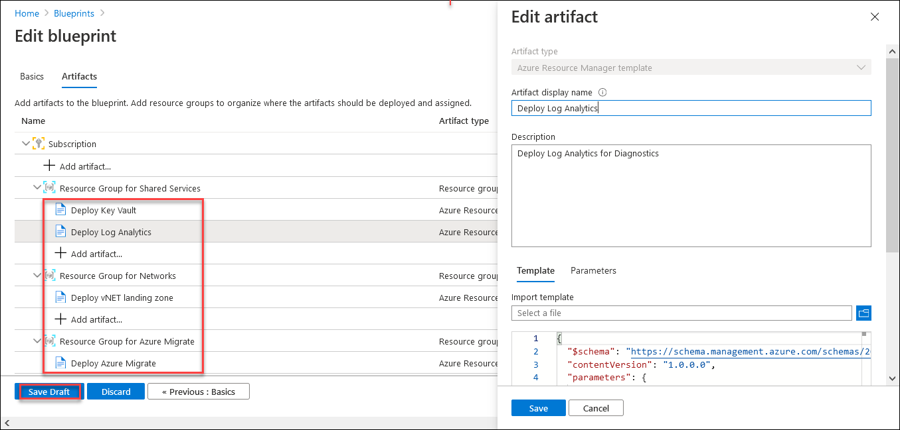 

7. Click on **Save Draft** to save the blueprint configurations as draft.

8. When a blueprint is first created, it's considered to be in Draft mode. When it's ready to be assigned, it needs to be Published , so the next step is to **publish the blueprint**.

9. Click on the blueprint definition you just created and then click on **Publish blueprint**
   
   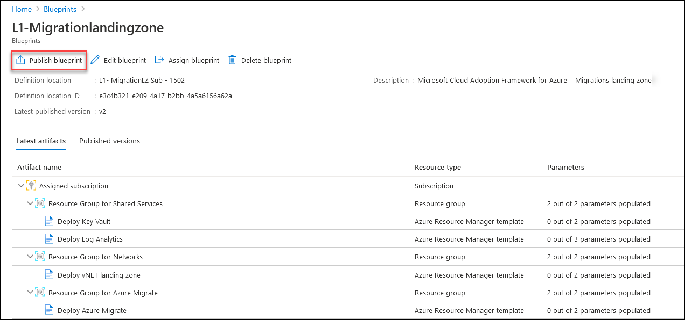 

10. Publishing requires defining a **Version** string (letters, numbers, and hyphens with a max length of 20 characters) along with optional **Change notes**. 

 - Provide the version as **v1.0** and click on **Publish** to publish the blueprint.
 
    
 
 > The Version differentiates it from future changes to the same blueprint and allows each version to be assigned. This versioning also means different Versions of the same blueprint can be assigned to the same subscription.
 
 11. Once the copy of the blueprint sample has been successfully Published, it can be assigned to a subscription it was saved to.
 
 12. Select the published blueprint definition and **Assign blueprint** at the top of the blueprint definition page. 
     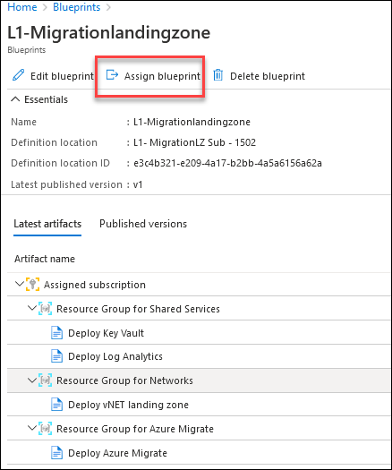 
      
 13. On the **Assign blueprint** page , provide the parameter values for the blueprint assignment:
    
     **Basics**
     - Subscriptions: Select the subscription you saved your copy of the blueprint sample to. 
       In this case it is **L1- MigrationLZ Sub-Suffix** subscription.
       
     - Assignment name: The name is pre-populated for you based on the name of the blueprint. Change as needed or leave as is.(For example:Assignment-L1-Migrationlandingzone)
       
     - Location: Select a region for the managed identity to be created in.
        >Azure Blueprint uses this managed identity to deploy all artifacts in the assigned blueprint.
       
     - Blueprint definition version: Pick a Published version of your copy of the blueprint sample.
       Version: **v1.0**
       
     - Lock Assignment: Leave the default value
       
     - Managed Identity: Choose the default system assigned managed identity option.

     **Blueprint parameters:** 
       >The parameters defined in this section are used by many of the artifacts in the blueprint definition to provide consistency.
     - Organization: Enter your organization name as **TWTL1-Suffix**
     - AzureRegion: Select one Azure Region for Deployment.
     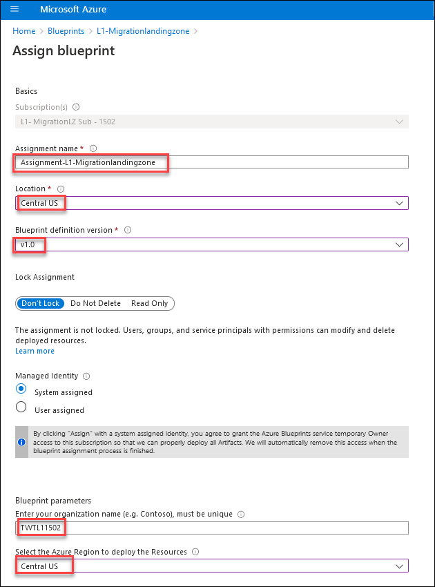 

     **Artifact parameters**
       >The parameters defined in this section apply to the artifact under which it's defined. These parameters are dynamic parameters since they're defined during the assignment of the blueprint. 
       
      - Deploy key vault: Provide the **ObjectID** of the account you are using to perform the lab.
      - Deploy log analytics: Provide the value **30** for Number of days data will be retained in Log Analytics.
        Region: Provide the same region where you are deploying the blueprint.
      - Deploy vNET Landing zone : Provide the Virtual Network IP Addressspace as **10.0**
      - Deploy Azure Migrate: Provide the same region where you are deploying the blueprint.

       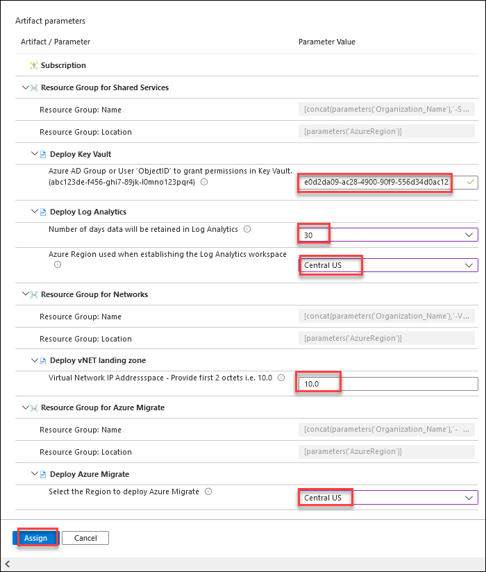 

14. Once all parameters have been entered, select **Assign** at the bottom of the page. The blueprint assignment is created and artifact deployment begins. Deployment takes around five minutes. To check on the status of deployment, open the blueprint assignment.
 
    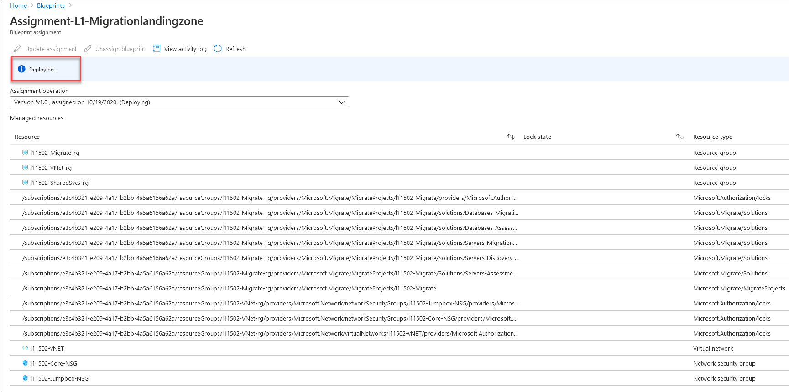
 
15. After the assignment is **Succeeded** ,review the resources deployed by this blueprint.
   
    
   
  
#### Task 2: Update the Azure migrate landing zone blueprint sample to match with DMZ Architecture

1. Select the blueprint definition **L1-Migrationlandingzone** created in previous task and Click on **Edit blueprint**.
   
   
     
2. Navigate to **Next Artifacts->** and under the **Resource Group for Networks** click on **Deploy Vnet Landing zone**

3. Remove the existing code for **Deploy Vnet Landing zone** and replace it with https://raw.githubusercontent.com/srushti-714/Cloud-Adoption-Framework-In-A-Day/main/Instructions/Templates/DMZ-VNET.json which deploys the **Virtual Network** to match with DMZ architecture.

   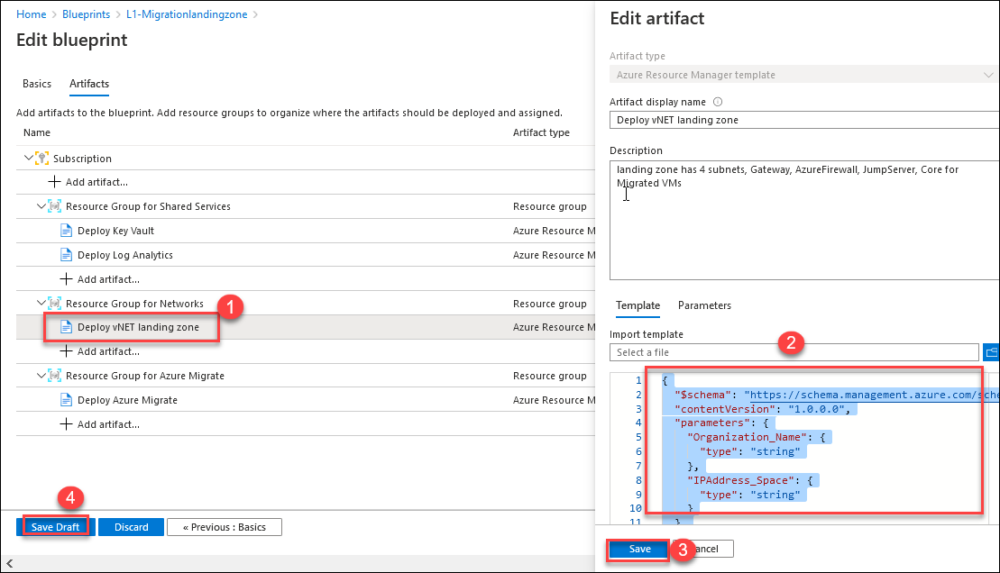
     
4. Click on **Save Draft**

5. Click on the edited blueprint definition and then click on **Publish blueprint**.
   - Provide the version as **V2.0** and click on **Publish** to save the changes.
  
   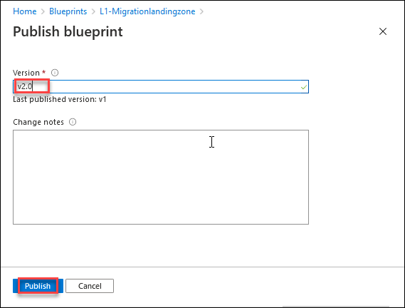 
  
6. Select **Unassign blueprint** to unassign the previously assigned blueprint of task 1.
   
   
  
5. Now click on **Assign blueprint** and provide the required parameters and click on **Assign**

6. You have successfully deployed the blueprint which has VNET that matches the DMZ architecture.

