# Exercise 2: Governance

## Context

Migrations have gone well. However, there are no strict governance established across the organization. 
Tailwind Traders need to establish recommended best practices for governance and a way to audit that no deployments have been made that bypass those rules. This audit needs to scale across the entire organization.

- Enable Resource Consistency
- Enable Security Baseline
- Enable Cost Management

CAF Migration landing zone implementation option does not implement any governance tooling and is being used for limited production deployment to initiate learning, iteration, and development of the overall operating model in parallel to these early stage migration efforts. To accelerate parallel development of governance disciplines, you will be deploying the **CAF Foundation blueprint** in this exercise.

## Reference architecture

The Microsoft Cloud Adoption Framework for Azure (CAF) Foundation blueprint deploys a set of core infrastructure resources and policy controls required for your first production grade Azure application. This foundation blueprint is based on the recommended pattern found in CAF.

The CAF Foundation blueprint sample deploys recommended infrastructure resources in Azure that can be used by organizations to put in place the foundation controls necessary to manage their cloud estate. This sample will deploy and enforce resources, policies, and templates that will allow an organization to confidently get started with Azure.

This implementation incorporates several Azure services used to provide a secure, fully monitored, enterprise-ready foundation. You will explore the resources deployed and policy defintions available with this blueprint in the below tasks.

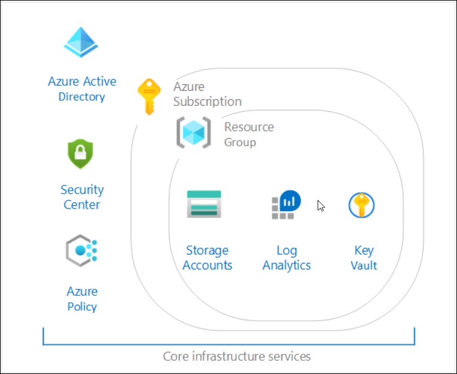 

>You will see **DeploymentID** value on the Lab Environment tab, please use it wherever you see DeploymentID in lab steps. This is a unique number associated with each lab deployment.

>Note: **L2-Governance Sub-Suffix** subscription is used to perform this exercise.

#### Task 1: Deploy the Microsoft Cloud Adoption Framework for Azure Foundation blueprint sample

In this task you will deploy the Microsoft Cloud Adoption Framework for Azure (CAF) Foundation blueprint sample. The CAF Foundation blueprint does not deploy a landing zone. Instead, it deploys the tools required to establish a governance MVP (minimum viable product) to begin developing your governance disciplines.

The below steps must be followed to deploy the Azure Blueprints CAF Migration landing zone blueprint sample:

- Create a new blueprint from the sample
- Mark your copy of the sample as Published
- Assign your copy of the blueprint to an existing subscription

1. From the Azure portal , type **Blueprint** at the search bar and select **Blueprints** under services. You will be redirected to **Blueprints| Getting started** page.
   
   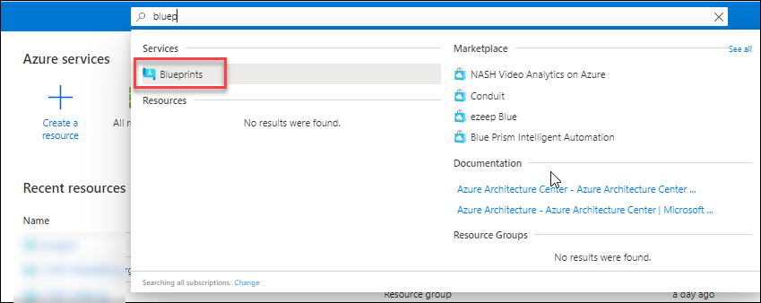

2. On the **Blueprints| Getting started** page, under the **Create a blueprint** header click on **Create**. This will redirect to **Create blueprint** page.

3. Now on the **Create blueprint** page, under the **Choose a blueprint sample** header, type **CAF** at the search bar and select the predefined blueprint sample **CAF Foundation**. You will be redirected to **Create blueprint** page.

    
 
4. On the **Create blueprint** page create the blueprint with the following characteristics:
   - Blueprint name : `L2-CAFFoundationzone`
   - Blueprint description : Leave the default description
   - Definition location: Click on **ellipse (**...**)** symbol.
   
   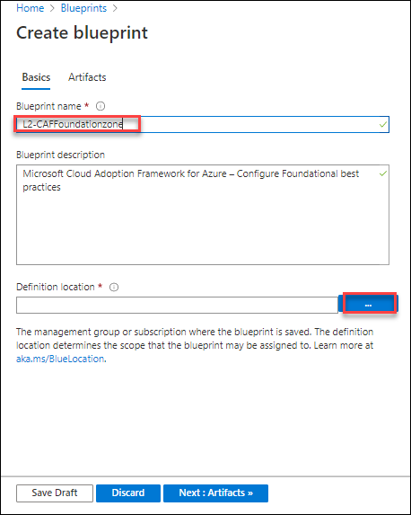 
   
5. Next, set the **Definition Location** value to a subscription named **L2-Governance Sub-Suffix** and then click on **Select** to return back to the Create blueprint page
     
    

   >The definition location determines the **scope** that the blueprint may be assigned to, the management group or subscription where the blueprint is saved.

6. Click on **Next:Artifacts>>** section and explore the artifacts included along with the **CAF Foundation Zone blueprint sample**
   
7. Click on **Save Draft** to save the blueprint configurations as draft.

   >Note: Click **Save Draft** and allow approximately **10 seconds** for the Blueprint Definition to be saved
      
8. Click on **Publish blueprint**.
   
   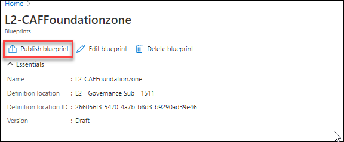 
   
   >Note: When a blueprint is first created, it is considered to be in Draft mode. When it is ready to be assigned, it needs to be Published.
   
9. Enter the version as **v1.0** and click on **Publish** to publish the blueprint.

    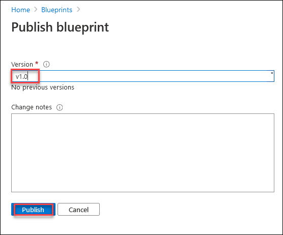
   
10. The Blueprint sample copy is ready to be assigned to the subscription to which it is saved once it is published.
 
11. Select **Assign blueprint** option at the top of the blueprint definition page of **L2-CAFFoundationzone** 
    
    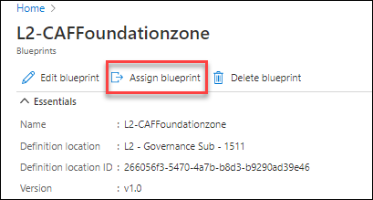
    
    >Navigate back to the Blueprints blade then under the Blueprint definitions section select the published blueprint definition `L2-CAFFoundationzone` if you are in a different page.

12. On the **Assign blueprint** page, provide the parameter values for the blueprint assignment:
    
     **Basics**
    
      - **Subscriptions**: The subscription `L2-Governance Sub-Suffix` should be pre-selected and grayed out. This value reflects the Subscription where your Blueprint copy is saved.
     - **Assignment name**: The name is pre-populated for you based on the name of the blueprint **Assignment-L2-CAFFoundationzone**
       
     - **Location**: `CentralUS`
       >Region for the managed identity to be created in.Azure Blueprint uses this managed identity to deploy all artifacts in the assigned blueprint.
       
     - **Blueprint definition version**: `v1.0`
       >Pick a Published version of your copy of the blueprint sample
       
     - **Lock Assignment:** Leave the default value
       
     - **Managed Identity:** Choose the default **system assigned** managed identity option.

     **Blueprint parameters:** 
     
       >The parameters defined in this section are used by many of the artifacts in the blueprint definition to provide consistency.
       
     - **Organization**: Enter your organization name as **TTDeploymentID** 
     >Replace the DeploymentID value with the value given in the Lab environment tab
     
     - **AzureRegion**: `CentralUS`
     
       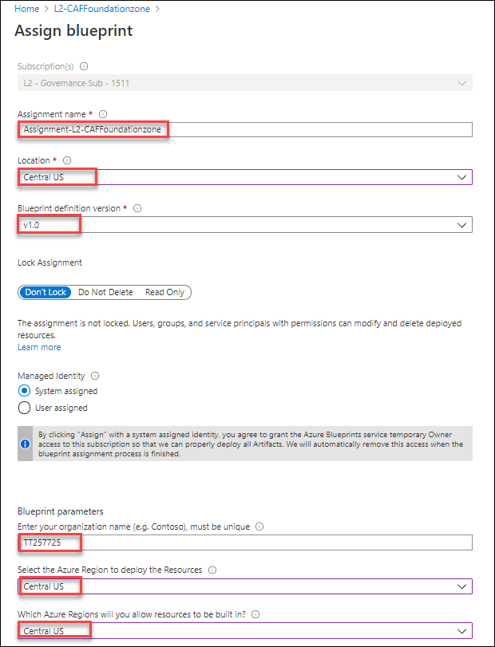
      
     **Artifact parameters**
     
       >The parameters defined in this section apply to the artifact under which it is defined. These parameters are dynamic parameters since they are defined during the assignment of the blueprint. 
        
      - Allowed storage account SKUs : **Standard_LRS**
      
      - Allowed virtual machine SKUs : Leave the **default values** here, you can select the small sized vm sku size in order to reduce the cost.
      
      - Append CostCenter TAG to Resource Groups: **dev**
      
      - Resource Types that you do not want to allow in your environment: **You will be doing this is the next task**.

      - **Deploy Key Vault:** Provide the **Objectid** value 
         >Get the Objectid value from the **Lab Environment** tab.
         
      - Deploy Log Analytics: Provide the value **30** for Number of days data will be retained in Log Analytics.
      - Region: `CentralUS`
      
        Leave other options set to default values.
        
        Once all parameters have been entered, select **Assign** at the bottom of the page.
   
        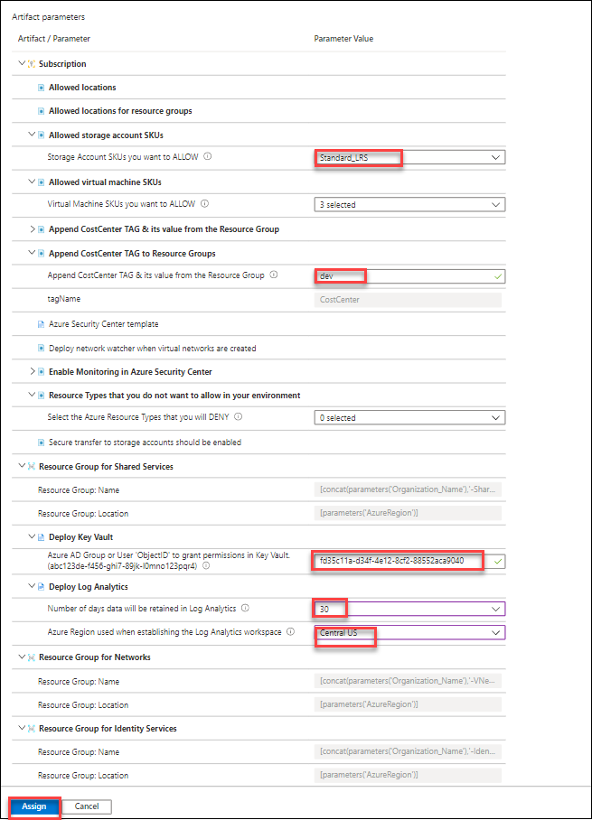
    
13. Now the blueprint assignment is created and the artifact deployment begins. This deployment will take around **seven** minutes. 

14. To check on the status of deployment, click on **notifications** icon and click on the **Blueprint assignment succeeded**
    
    

15. Observe the resources which are being deployed by the blueprint.
    
    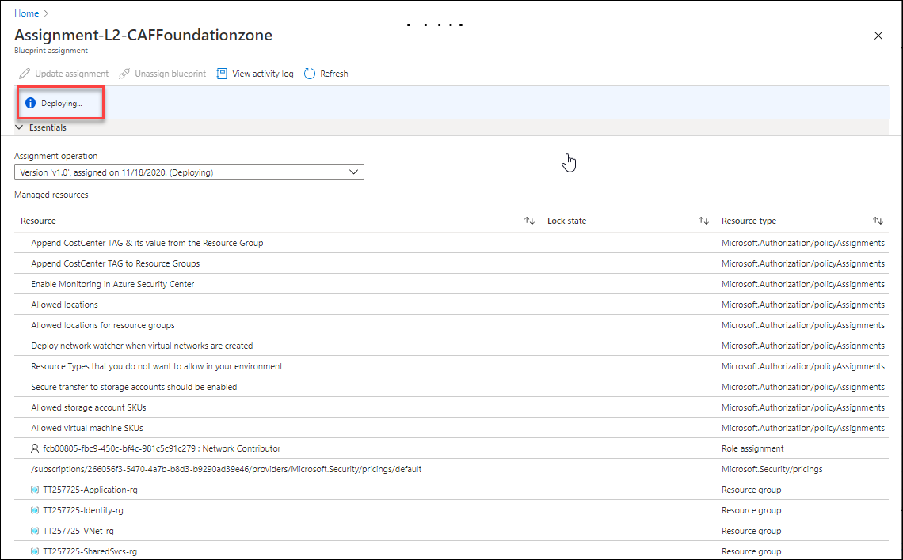 
 
    >You can also check the deployment status by opening the blueprint assignment **Assignment-L2-CAFFoundationzone** from the **Blueprints** page and **Assigned blueprints** section, ensure you select the right scope **L2-Governance Sub-Suffix**.
 
16. After the assignment is **Succeeded** review the deployed resources by the blueprint.

    
     
17. In the upper left corner of the portal window, to open the Resource Groups menu, click the toggle menu icon and then click on **Resource groups**.
    
    
    
    This blade displays all of the resource groups that you have access to the Azure subscriptions.
    
 18. On the **Resource Groups** blade filter the resource groups by Subscription **L2-Governance Sub-Suffix** and observe that four resource groups named **TTDeploymentIDApplication-rg,TTDeploymentIDVnet-rg, TTDeploymentIDIdentity-rg and TTDeploymentIDSharedSvcs-rg** are created .
 
     >**TTDeploymentIDApplication-rg, TTDeploymentIDVnet-rg and TTDeploymentIDIdentity-rg** are empty resource groups.
     
     
       
 19. Select the resource group **TTDeploymentIDSharedSvcs-rg** and review the deployed resources.
      - An **Azure Key Vault** instance used to host secrets used for the VMs deployed in the shared services environment
      - **Log Analytics** is deployed to ensure all actions and services log to a central location from the moment you start your secure deployment in to Storage Accounts for diagnostic logging
      - And a **Storage account** is created to store the diagnostic files.
      
     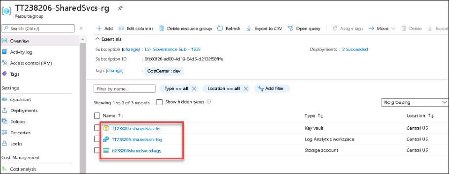
     
 20. Now, type **Policy** at the search bar and select **Policy** under services.

     
     
 21. Click on **Assignments** under Authoring section and select the scope to **L2-Governance Sub-Suffix**
 
 22. Review the policies that are assigned at the subscription **L2-Governance Sub-Suffix** by the blueprint `L2-CAFFoundationzone`
 
     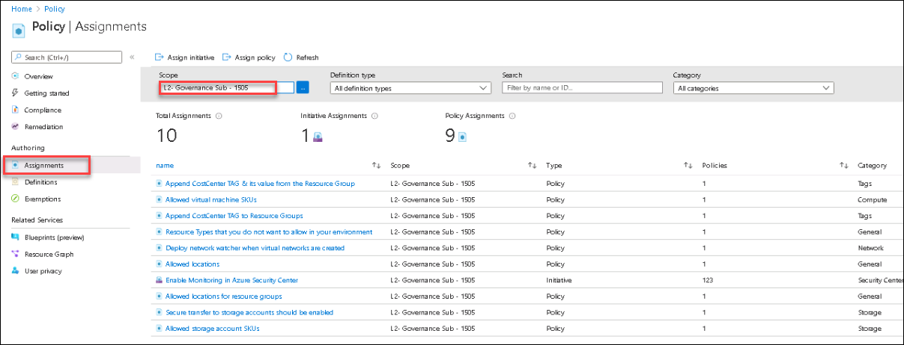
     
#### Task 2: Enable Resource Consistency

In this task you will explore the resources and policies deployed by the blueprint **CAFFoundationzone** in the previous task.

1.  Navigate to **Blueprints** page under the **Blueprint definitions** section, select **L2-CAFFoundationzone** then Click on **Edit blueprint**.
   
    
    
    >Select the scope **L2-Governance Sub-Suffix** if it is set to different subscription.
    
2. On the **Edit blueprint** click on **Next:Artifacts>>** and **explore the artifacts** included by default with the **CAF Foundation Zone** blueprint sample.
    
   
   
   **The blueprint is composed of following artifacts:**
   - **Azure Security Center** (standard version) provides threat protection for your migrated workloads
   - An **Azure Key Vault** instance used to host secrets used for the VMs deployed in the shared services environment
   - **Log Analytics** is deployed to ensure all actions and services log to a central location from the moment you start your secure deployment in to Storage Accounts for diagnostic logging

   **The blueprint also defines and assigns the following Azure Policy assignments:**

   - Append CostCenter TAG & its value from the Resource Group : This policy appends the specified tag **CostCenter** and its value to the **resources from the resource groups** if resources are missing this tag when created or updated.
   
   - Append CostCenter TAG to Resource Groups:This policy appends the specified tag **CostCenter** and its value to **resource groups** if any resource group is missing this tag when created or updated. 
   
   - Enable Monitoring in Azure Security Center
   
   - Allowed locations

   - Allowed locations for resource groups

   - Deploy network watcher when virtual networks are created 

   - Resource Types that you do not want to allow in your environment : You can select only the resource types which are needed for the environment and restirct the other resources by enforcing this policy.

   - Secure transfer to storage accounts should be enabled 

   - Allowed storage account SKUs

   - Allowed virtual machine SKUs
   
3. You can see the policy assignment **Resource Types that you do not want to allow in your environment** is used to restrict unwanted resource types, which will help in optimizing the cost.
   >Note: You will be selecting the resource types which you want to deny while assigning the blueprint.

4. And also to prevent any accidental deletion of resources we will be enforcing the **resource level locks**.
   >Note: You will be selecting the lock types that you want to apply while assigning the blueprint.

#### Task 3: Security Baseline

In this task you will be updating the blueprint by assigning the policy assignments inorder to increase the security level.

1. On the **Edit blueprint** page of **L2-CAFFoundationzone**, Under the **Subscription** header click on **+Add Artifact** and select the **Policy assignment** as the artifact type.
   
   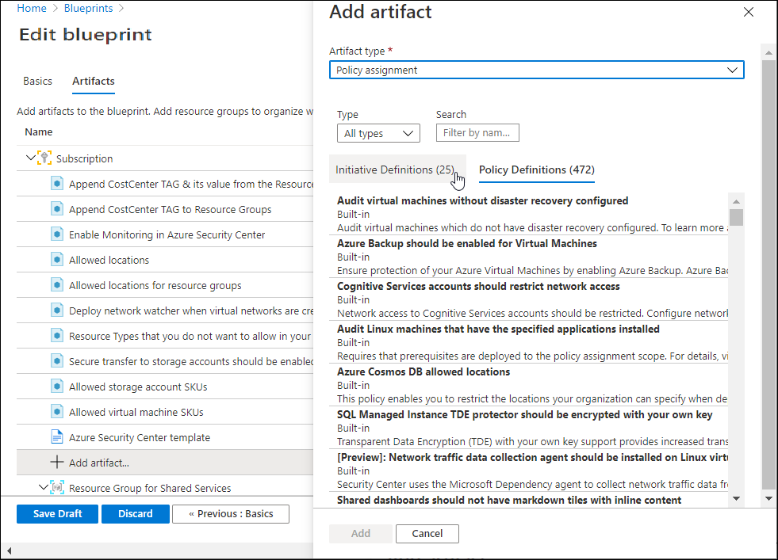 

2. **Search** for the following policy assignment 
   
   - Storage accounts should restrict network access
   
     Select the policy assignment and click on **Add**.
    
      
   
 3. Similarly search the remaining policy assignments and click on **Add**
 
   - Audit usage of Custom RBAC rules
   - Audit Linux machines that have accounts without passwords
   - Audit Linux machines that are not using SSH key for authentication
   - Audit Windows machines that have extra accounts in the Administrators group
 
      
   
     >**Note**: These policy assignments are available along with the blueprint sample
  
4. Click on **Save Draft** once all the policy definitions are added to save the blueprint configurations as draft.

   >Note: Click **Save Draft** and allow approximately **10 seconds** for the Blueprint Definition to be saved

5. Select the **Publish blueprint** option and provide the version as **v2.0** and click on **Publish**.
   
   .
   
   >Navigate to **Blueprints** page and under the **Blueprint definitions** section click on the edited blueprint definition **L2-CAFFoundationzone** in case you are on a different page.
 
6. Now return back to **Blueprints** page, under the **Assigned blueprints** section choose the scope **L2-Governance Sub-Suffix** if it is set to different subscription and select the assignment **Assignment-L2-CAFFoundationzone**.

   
  
7. Click on **Update assignment** to update the assignment with latest version of blueprint.

    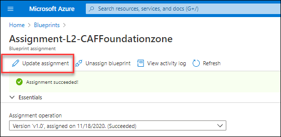 
   
8. On the **Assign blueprint** provide the parameter values for the to update the blueprint assignment:
 
   - **Blueprint definition version**: Pick a Published version of your  edited copy of the blueprint sample i.e., **v2.0**
       
   - **Lock Assignment:** Select **DonotDelete** option to enforce locks at resource level.
      
     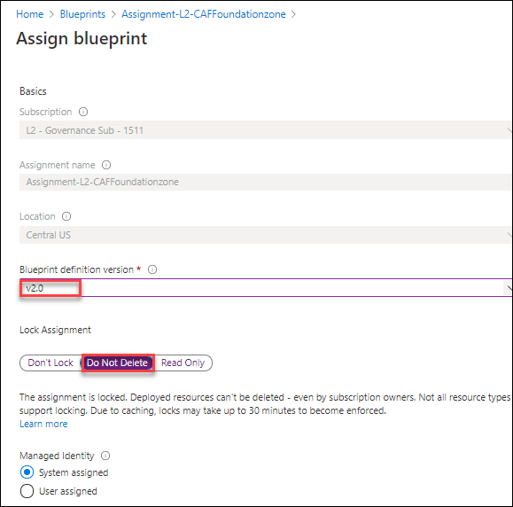
      
   - **Under Artifact parameters**
     >The parameters defined in this section apply to the artifact under which it is defined. These parameters are dynamic parameters since they are defined during the assignment of the blueprint. 
       
    - Resource Types that you do not want to allow in your environment: Search for **expressroute** and select all resources of expressroute. **There are 9 ExpressRoute resources selectable in this list**. 
        
      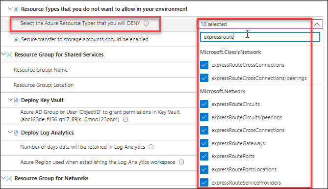
        
    - **Leave all the other options to default prepopulated values.**

9. Once all parameters have been entered, Click on **Assign** at the bottom of the page.

10. The blueprint assignment is created and artifact deployment begins , the deployment takes around **five** minutes. 

11. To check on the status of deployment, click on **notifications** icon and click on the **Blueprint assignment succeeded**
    
    
    
    >You can also check the deployment status by opening the blueprint assignment **Assignment-L2-CAFFoundationzone** from the **Blueprints** page and **Assigned blueprints** section, ensure you select the right scope **L2-Governance Sub-Suffix**.

12. After the assignment is succeeded, In the upper left corner of the portal window to open the Resource Groups menu, click the toggle menu icon and then click on **Resource groups**.
    
    
    
    This blade displays all of the resource groups that you have access to the Azure subscriptions.
    
    >Select the scope **L2-Governance Sub-Suffix** if it is set to different subscription.
  
13. Select the resource group **TTDeploymentIDSharedSvcs-rg** and under the **settings** section, select **Locks** to see that resource locks are applied for each resource in the resource group.

    

14. Now, type **Policy** at the search bar and select **Policy** under services.

    
    
15. Click on **Assignments** under Authoring section and select the scope to **L2-Governance Sub-Suffix**
       
16. Review all the policies assigned by the v2.0 blueprint by selecting the scope `L2-Governance Sub-Suffix`

    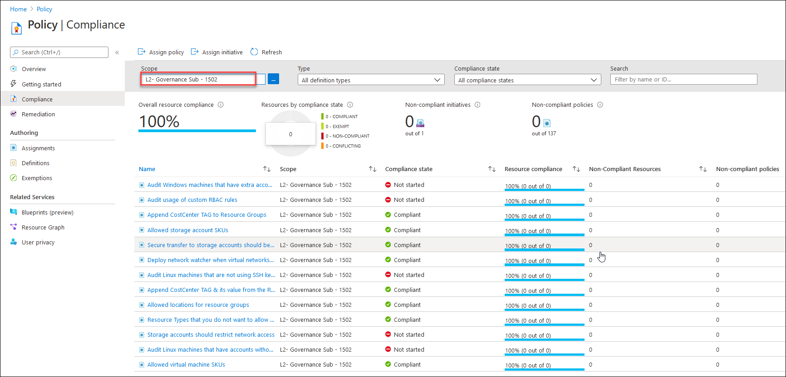
    
    >CAF Foundation zone blueprint is deployed in `L2-Governance Sub-Suffix` so we are setting the scope for this subscription.

#### Task 4: Cost management

 In this task you will learn how to use **tags** to manage costs. **Tags** are a effective way to track costs by organizing the resources that span across multiple teams and Azure scopes. After you plan for resource tagging, you can configure an Azure policy to enforce tagging on resources. When tags are applied properly, you can apply them as a filter in **cost analysis** which helps in better understanding of cost and usage patterns.

#### Subtask1: Explore the policies applied to manage the cost.
 
1. **Append CostCenter TAG to Resource Groups**
    
   The policy Append CostCenter TAG to Resource Groups appends the specified tag **CostCenter** and its value to **resource groups** if any resource group is missing this tag when created or updated. 
   
   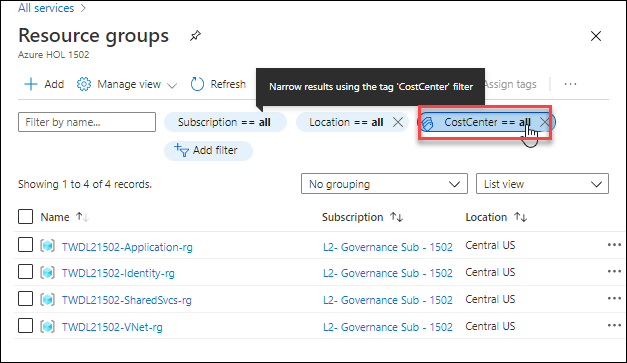
 
2. **Append CostCenter TAG & its value from the Resource Group**
   
   The policy Append CostCenter TAG & its value from the Resource Group appends the specified tag **CostCenter** and its value to the **resources from the resource groups** if resources are missing this tag when created or updated.
   
   >Note: Both the policy definitions **Append CostCenter TAG to Resource Groups** and **Append CostCenter TAG to Resource Groups** are by default included with the blueprint sample **CAFFoundation**
   
   
   
   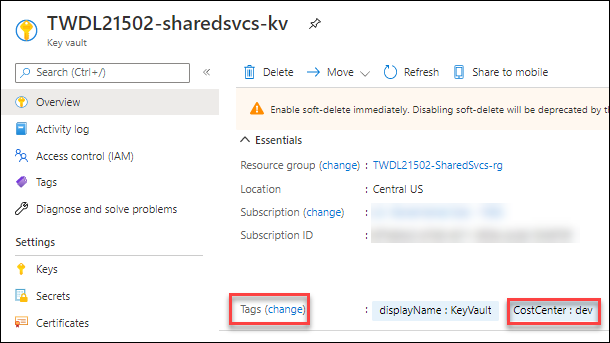
  
  >Note: To learn more about CAF Foundation zone : https://docs.microsoft.com/en-us/azure/governance/blueprints/samples/caf-foundation/
  
  In this exercise you created a blueprint based on CAF Foundation zone, also learn about best practices for governance that is resource consistency,security baseline and how to manage the cost to ensure no deployments have been made that bypass the rules.

  Click on **Next** to proceed for the next exercise.
