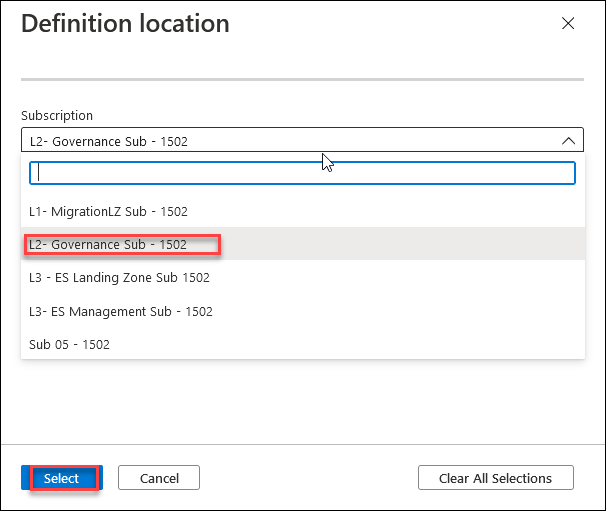

# Exercise 2: Governance

## Context

Migrations have gone well. However, there are no strict governance established across the organization. 
Tailwind Traders need to establish recommended best practices for governance and a way to audit that no deployments have been made that bypass those rules. This audit needs to scale across the entire organization.
•	Enable Resource Consistency
•	Enable Security Baseline
•	Enable Cost Management

## Reference architecture

The Microsoft Cloud Adoption Framework for Azure (CAF) Foundation blueprint deploys a set of core infrastructure resources and policy controls required for your first production grade Azure application. This foundation blueprint is based on the recommended pattern found in CAF.

The CAF Foundation blueprint sample deploys recommended infrastructure resources in Azure that can be used by organizations to put in place the foundation controls necessary to manage their cloud estate. This sample will deploy and enforce resources, policies, and templates that will allow an organization to confidently get started with Azure.

This implementation incorporates several Azure services used to provide a secure, fully monitored, enterprise-ready foundation. You will explore the resources deployed and policy defintions available with this blueprint in further tasks.

 

#### Task 1: Deploy the Microsoft Cloud Adoption Framework for Azure Foundation blueprint sample

In this task you will deploy the Microsoft Cloud Adoption Framework for Azure (CAF) Foundation blueprint sample and the following steps must be taken:

- Create a new blueprint from the sample
- Mark your copy of the sample as Published
- Assign your copy of the blueprint to an existing subscription

1. Search for **Blueprint** from the search bar.

2. On the **Blueprints| Getting started** page, under the **Create a blueprint** header click on **Create** to start configuring the blueprint. 
    
3. Under the **Choose a  blueprint sample**, **Select** the already available blueprint sample **CAF Foundation Zone**

    
 
4. On the **Create blueprint** page , Provide the following details:
   - Name : **L2CAFFoundationzone**
   - Blueprint description : Leave the default description
   - Definition location: Click on **...** symbol.
   
    
   
5. The definition location determines the **scope** that the blueprint may be assigned to, the management group or subscription where the blueprint is saved.
   - **Definition Location** : Select the **Subscription** named **L2-Governance Sub-Suffix**
   - Click on **Select** and return to the Create blueprint page
     
    

6. Click on **Next:Artifacts>>** and explore the artifacts included along with the **CAF Foundation Zone blueprint sample**
   **The blueprint is composed of following artifacts:**
   - An Azure Key Vault instance used to host secrets used for the VMs deployed in the shared services environment
   - Log Analytics is deployed to ensure all actions and services log to a central location from the moment you start your secure deployment in to Storage Accounts for diagnostic logging
   - Azure Security Center (standard version) provides threat protection for your migrated workloads

  **The blueprint also defines and deploys the following Azure Policy definitions:**

   - Tagging (CostCenter) applied to resources groups
   - Append resources in resource group with the CostCenter Tag
   - Allowed Azure Region for Resources and Resource Groups
   - Allowed Storage Account SKUs (choose while deploying)
   - Allowed Azure VM SKUs (choose while deploying)
   - Require Network Watcher to be deployed
   - Require Azure Storage Account Secure transfer Encryption
   - Deny resource types (choose while deploying)
   - Policy initiatives:
   - Enable Monitoring in Azure Security Center (100+ policy definitions)
    
    

7. Click on **Save Draft** to save the blueprint configurations as draft.

8. When a blueprint is first created, it's considered to be in Draft mode. When it's ready to be assigned, it needs to be Published , so the next step is to **publish the blueprint**.

9. Click on the blueprint definition you just created and then click on **Publish blueprint**
   
    
   
10. Provide the version as **v1.0** and click on **Publish** to publish the blueprint.

   
   
11. Once the copy of the blueprint sample has been successfully Published, it can be assigned to a subscription it was saved to.
 
12. Select **Assign blueprint** at the top of the blueprint definition page. 

 

