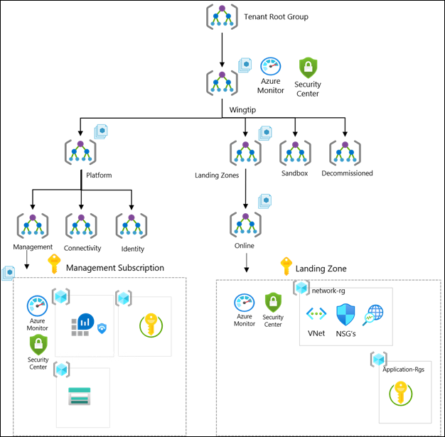
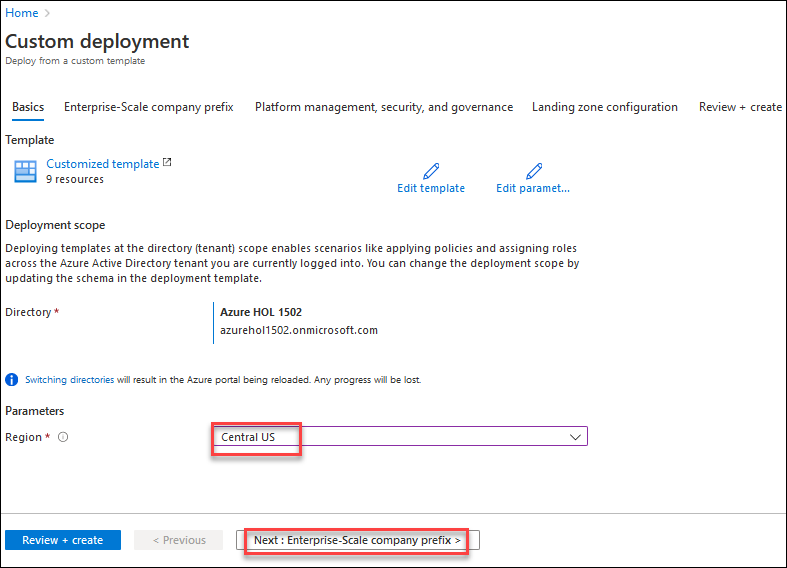
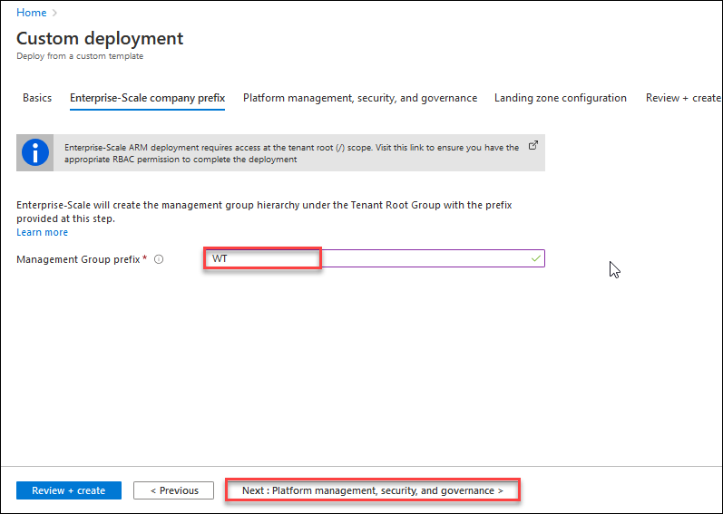
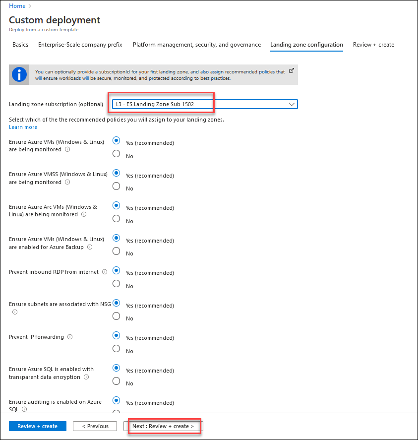
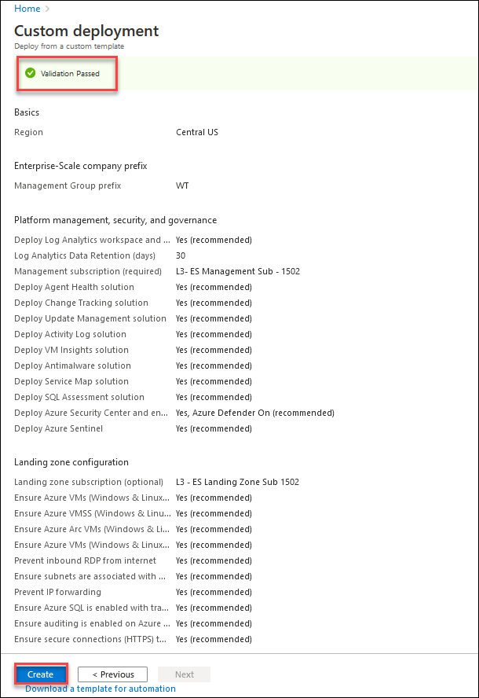

# Exercise 3: Enterprise Scale

## Context

The Enterprise-Scale architecture is modular by design and allow organizations to start with foundational landing zones that support their application portfolios, regardless of whether the applications are being migrated or are newly developed and deployed to Azure. The architecture enables organizations to start as small as needed and scale alongside their business requirements regardless of scale point.
The Wing Tip company want to start with Landing Zones for their workload in Azure, where hybrid connectivity to their on-premise datacenter is not required from the start. 

### Reference architecture

This reference implementation is ideal for customers who want to start with Landing Zones for their workload in Azure, where hybrid connectivity to their on-premise datacenter is not required from the start.

 

#### Task 1: Deploy the Management Group structure using ARM template and Policy Set definitions

In this task you are deploying the foundational Management Group structure as well as the policy and PolicySet definitions. To deploy this we will use the Contoso reference implementation ARM template.

1. Click on the **Deploy to Azure** button.

   

2. On the **Custom deployment** blade, in the Basics section, fill in the **Region** and click on **Next: Enterprise Scale Company Prefix.**

    

3. On the **Enterprise Scale Company Prefix** section, provide a company prefix (for this document, we will use **WT** as the prefix, but you can choose the prefix of your preference). Please click **Next: Platform management, security and governance** to move to the next section.

    
   
4. On the **Platform management, security and governance** section **management subscription** and policies need to be configured. Leave the other options set to default.
    And Click on **Next: Next: Landing zone configuration** to move to the next section.
    
    

5. In the **Landing zone configuration** section, your tenant will be enabled to host workload Landing Zones. Configure the section as illustrated in the following screenshot this will deploy the chosen policy assignment at the Landing Zone scope ,Select the **Landing zone subscription**.

   And Click on **Next : Review + create** to move to the next section.
   
    
  
6. After the template has passed the validation click **Create**. This will deploy the initial Management Group structure together with the required Policy/PolicySet definitions. It will also move the subscription under the right Management Group and will also deploy a Log Analytics Workspace and enable platform monitoring. This process will take around 10 minutes to complete. 

    

7. Once the deployment is completed successfully, in the Azure Portal type **Management Groups** into the search box and open the **Management Groups** blade and click on the **WT** Management Group. 

   

8. You should see the following Management Groups in your environment:
   
    

9. In the **WT** Management Group click on **details**
   
    

10, Next, in the **WT** Management Group click on **Policies** 

    

11. In the **Policy | Definitions** blade, under **Type**, select **Custom**. If the deployment was successful, you will see a list of Initiative and policy definitions as shown below.
   
   

#### Task 2: Deploy Resources into ESLZ

#### Create a Key Vault and review Diagnostic settings

After deploying the ESLZ reference implementation (Wingtip), and bringing in a subscription for the platform management, policies are already assigned to ensure resources will have diagnostics/monitoring enabled.

1. Create a new Key Vault into the management subscription – into a new resource group.

2. Once you have started the deployment, monitor the Activity Log to see the policy effect. You should see “deployIfNotExists” Policy action even. 

3. Post a successful deployment of the KeyVault, you should start to see (approx. 6-10 minutes) another deployment resource appearing in the resource group.

4. Navigate to key vault and review the diagnostics settings, verify  if it is connected to your Log Analytics workspace.

5. Explore the Azure Monitor Insights view

#### Review Policy to your Landing Zone

As you saw in the previous task, policies ensures that security and compliance is being met regardless of how resources are being created. In this exercise, you will assign a new policy to ensure Key Vaults in the landing zones will always have soft-deletion enabled.

1. Navigate to Azure Policy and select the Online management group as scope.

2. Review the the policy definition **Append-KV-SoftDelete** and check what the policy will do on KeyVault resources.

