# Exercise 3: Enterprise Scale

## Context

The Enterprise-Scale architecture is modular by design and allow organizations to start with foundational landing zones that support their application portfolios, regardless of whether the applications are being migrated or are newly developed and deployed to Azure. The architecture enables organizations to start as small as needed and scale alongside their business requirements regardless of scale point.
The Wing Tip company want to start with Landing Zones for their workload in Azure, where hybrid connectivity to their on-premise datacenter is not required from the start. 

### Reference architecture

This reference implementation is ideal for customers who want to start with Landing Zones for their workload in Azure, where hybrid connectivity to their on-premise datacenter is not required from the start.You can build a flexible structure of management groups and subscriptions to organize your resources into a hierarchy for unified policy and access management. The following diagram shows an example of creating a hierarchy for governance using management groups.

 

If your organization has many subscriptions, you may need a way to efficiently manage access, policies, and compliance for those subscriptions. Azure management groups provide a level of scope above subscriptions. You organize subscriptions into containers called **management groups** and apply your governance conditions to the management groups. All subscriptions within a management group automatically inherit the conditions applied to the management group. Management groups give you enterprise-grade management at a large scale no matter what type of subscriptions you might have. All subscriptions within a single management group must trust the same Azure Active Directory tenant.

For example, you can apply policies to a management group that limits the regions available for virtual machine (VM) creation. This policy would be applied to all management groups, subscriptions, and resources under that management group by only allowing VMs to be created in that region.

>You will see **DeploymentID** value on the Lab Environment tab, please use it wherever you see DeploymentID in lab steps. This is a unique number associated with each lab deployment.

>**Note:** You will use the subscriptions L3 - ES Landing Zone Sub -Suffix and L3- ES Management Sub - Suffix for this exercise.

#### Task 1: Deploy the Management Group structure using ARM template and Policy Set definitions

In this task you are deploying the foundational Management Group structure as well as the policy and PolicySet definitions. To deploy this we will use the Contoso reference implementation ARM template.

1. Click on the **Deploy to Azure** button.

   

2. On the **Custom deployment** blade, in the Basics section, fill in the **Region** and click on **Next: Enterprise Scale Company Prefix.**

    

3. On the **Enterprise Scale Company Prefix** section, provide a company prefix (for this document, we will use **WT** as the prefix, but you can choose the prefix of your preference). Please click **Next: Platform management, security and governance** to move to the next section.

    
   
4. On the **Platform management, security and governance** section  select the management subscription **L3- ES Management Sub - Suffix** and policies need to be configured.     

   Leave the other options set to default and Click on **Next: Next: Landing zone configuration** to move to the next section.
    
   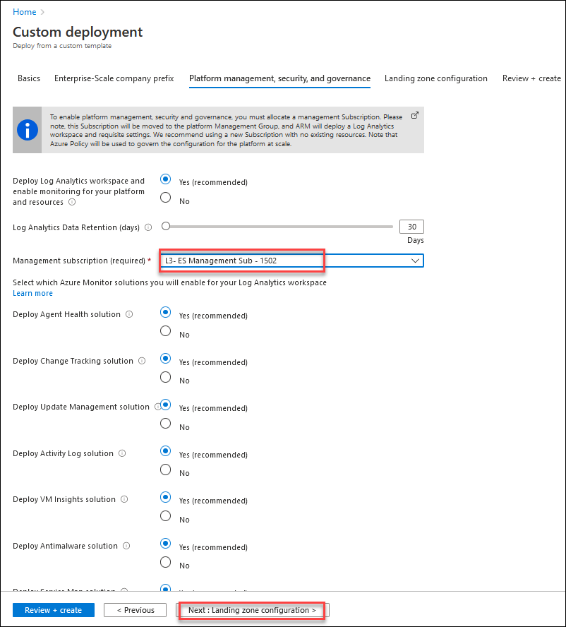 

5. In the **Landing zone configuration** section, your tenant will be enabled to host workload Landing Zones. Configure the section as illustrated in the following screenshot this will deploy the chosen policy assignment at the Landing Zone scope ,Select the Landing zone subscription that is **L3 - ES Landing Zone Sub -Suffix**

   And Click on **Next : Review + create** to move to the next section.
   
    
  
6. After the template has passed the validation click **Create**. This will deploy the initial Management Group structure together with the required Policy/PolicySet definitions. It will also move the subscription under the right Management Group and will also deploy a Log Analytics Workspace and enable platform monitoring. This process will take around 10 minutes to complete. 

    

7. Once the deployment is completed successfully, in the Azure Portal type **Management Groups** into the search box and select the **Management Groups** under services. 

   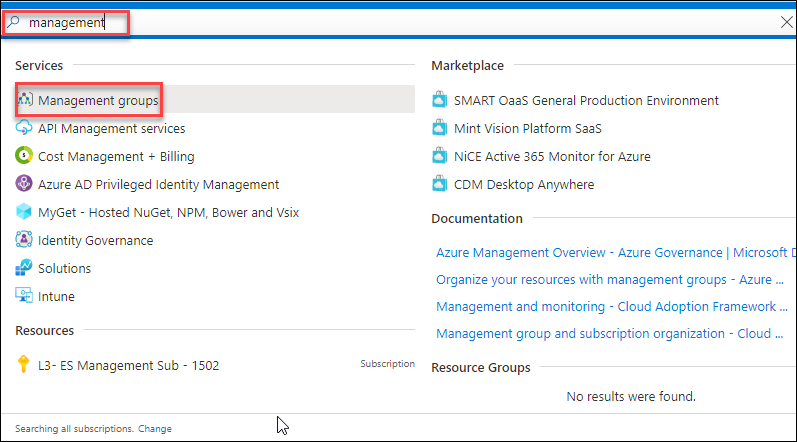
 
8. Click on the **WT** Management Group. 
   
    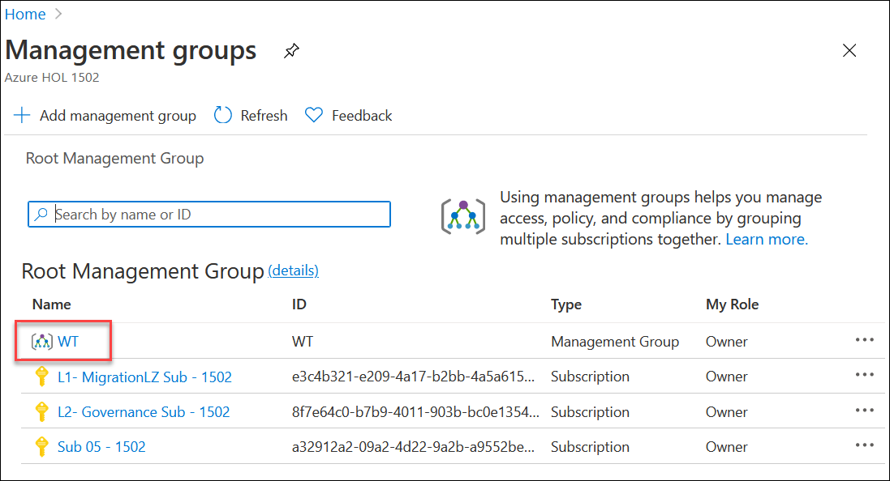 

9. You should see the following Management Groups in your environment:
   
   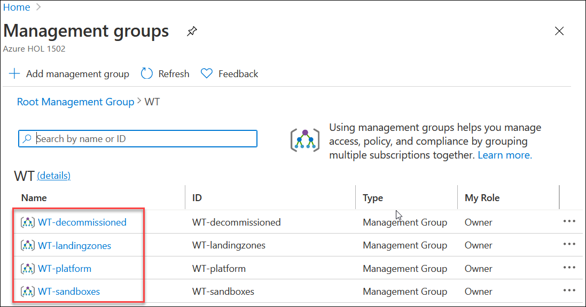 

10. In the **WT** Management Group click on **details**
   
    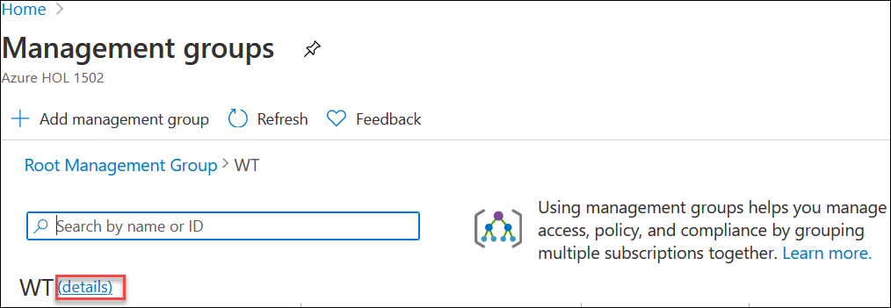 

11. Next, in the **WT** Management Group click on **Policies** 

     

12. In the **Policy | Definitions** blade, select the scope **WT** and under **Type** select **Custom** , you will see a list of Initiative and policy definitions as shown below which are assigned at the management group level.
   
    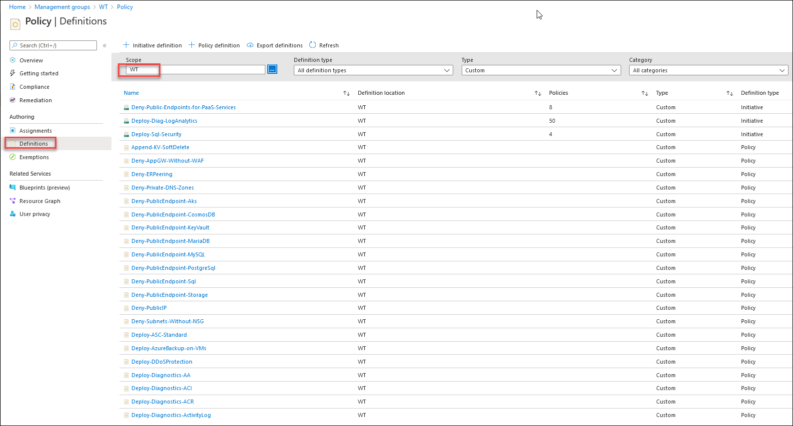 
    
13. Also review the resources deployed by the ARM template.
    
    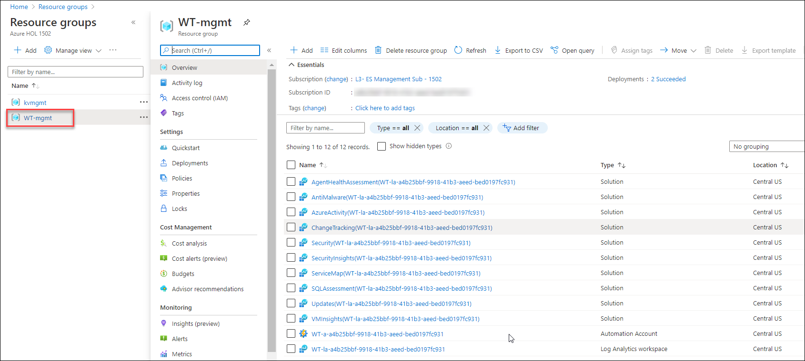
 
    >For more information about management groups check out this link https://docs.microsoft.com/en-us/azure/governance/management-groups/overview
 
#### Task 2: Deploy Resources into ESLZ

#### Create a Key Vault and review Diagnostic settings

After deploying the ESLZ reference implementation (Wingtip), and bringing in a subscription for the platform management, policies are already assigned to ensure resources will have diagnostics/monitoring enabled.

1. In the upper left corner of the portal window, to open the Resource Groups menu, click the toggle menu icon and then click on **Resource groups**.
    
    
    
2. In the Azure portal , type **keyvault** at the search bar and select **Keyvaults** under services.
   
   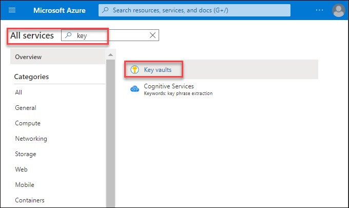
   
3. On the **Key vaults** page click on **+Add** .
    
   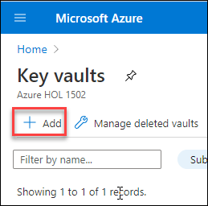

4. **Create a key vault by providing the following details:
   - Select the subscription **L3- ES Management Sub-Suffix** 
   - Create a resource group named **kvmgmt**
   - Provide the keyvault name : **kvsuffix**
   - Select the region where you want to deploy the key vault 
   - Leave the default options for other details
   
    Click on **Review+Create** to create the key vault.
   
    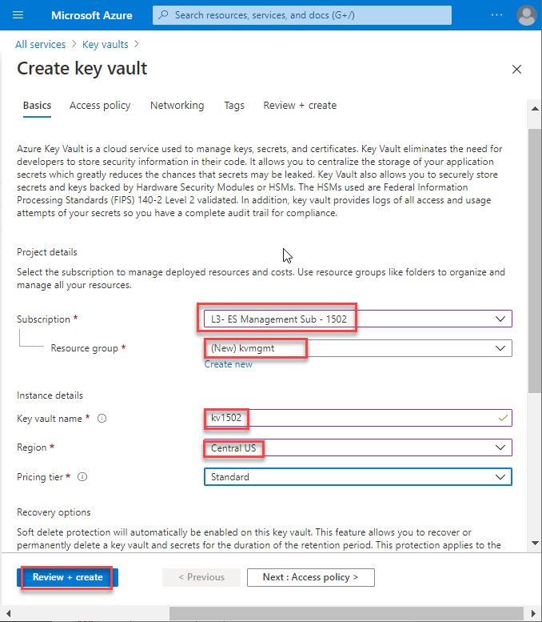

5. Once you have started the deployment, monitor the **Activity Log** to see the policy effect. You should see **deployIfNotExists** Policy action and examine the JSON payload
  
   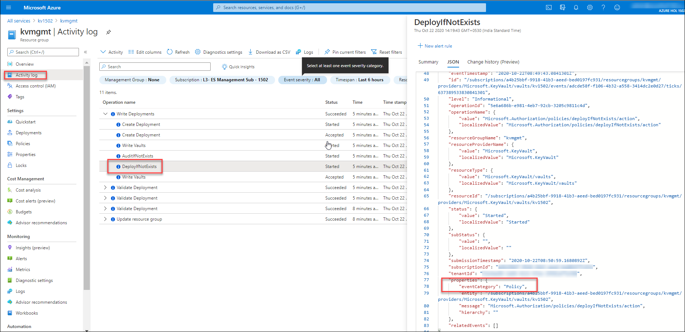
 
6. Post a successful deployment of the KeyVault, you should start to see (approx. 6-10 minutes) another deployment of the resource appearing in the resource group.
   
  
7. Navigate to key vault you just created and review the **Diagnostics settings**, verify  if it is connected to your **Log Analytics workspace**.

   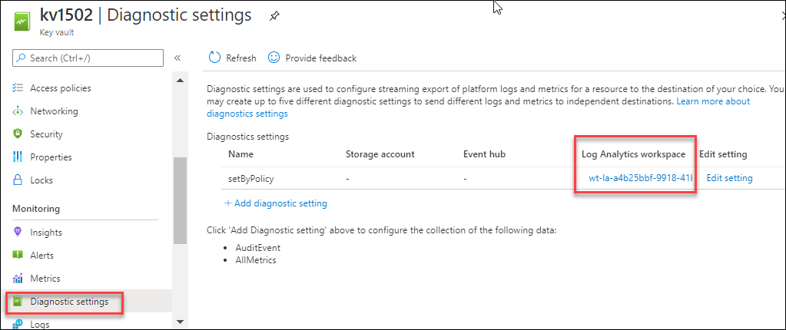
   
8. Now, on the keyvault page click on **Insights** under **Monitoring** and explore the Azure Monitor Insights view

   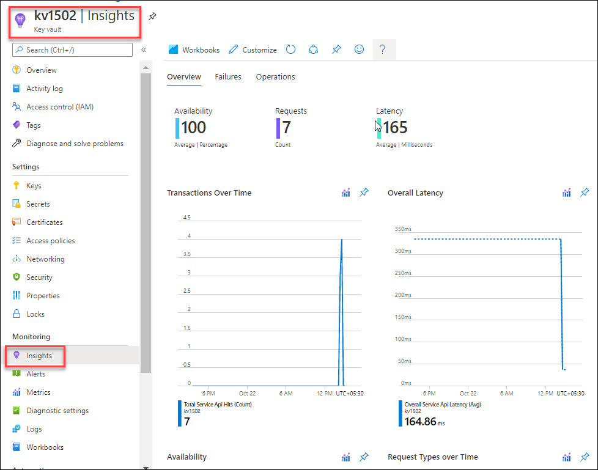
  
9. Navigate to Azure **Policy** and select the **management group** hosting the management subscription, and review compliance state of the policies.

   Also check the policies that are **non-compliant** in your environment and why?
   
   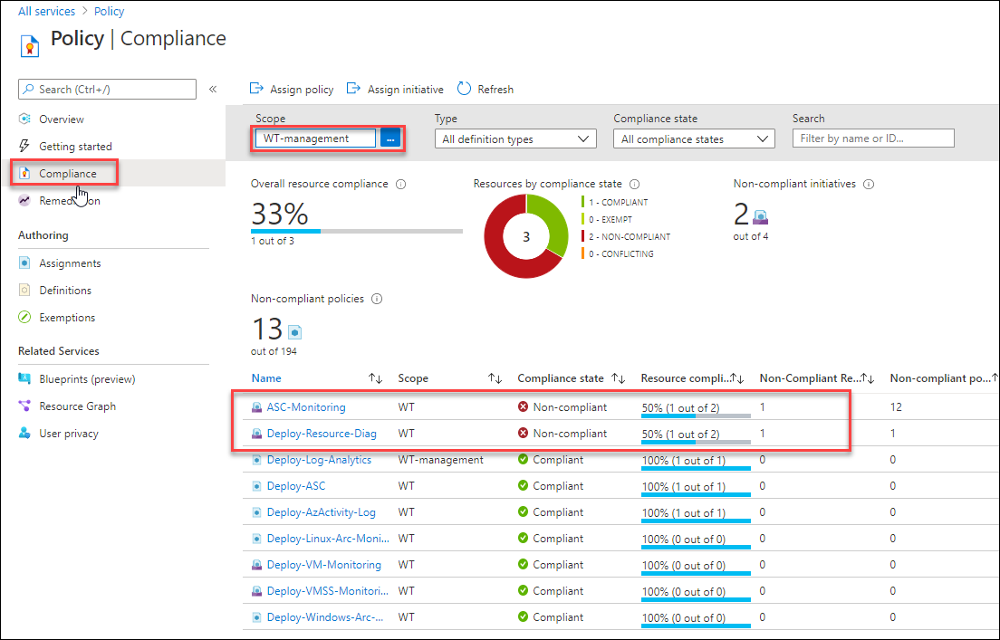 

#### Review Policy to your Landing Zone

As you saw in the previous task, policies ensures that security and compliance is being met regardless of how resources are being created. In this task , you will assign a new policy to ensure Key Vaults in the landing zones will always have soft-deletion enabled.

1. Now, type **Policy** at the search bar and select **Policy** under services.

   
      
2. Under **Policy** blade select **Definitions** under the Authoring section and select the **Online management group** as scope.
    
    - Definition type : Choose **Policy** and click on policy **Append-KV-SoftDelete**
    
   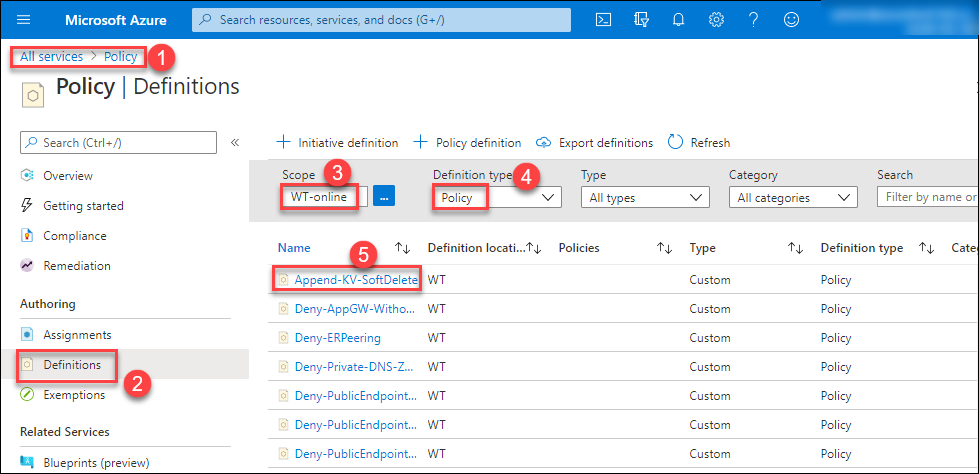
   
   >Note: When a Key Vault is created with out soft delete enabled then this policy Append-KV-SoftDelete will add it.
   
3. Review the the policy definition **Append-KV-SoftDelete** and check what the policy will do on KeyVault resources. Once reviewed, Click on **Assign** to assign the policy to a particular scope.
   
   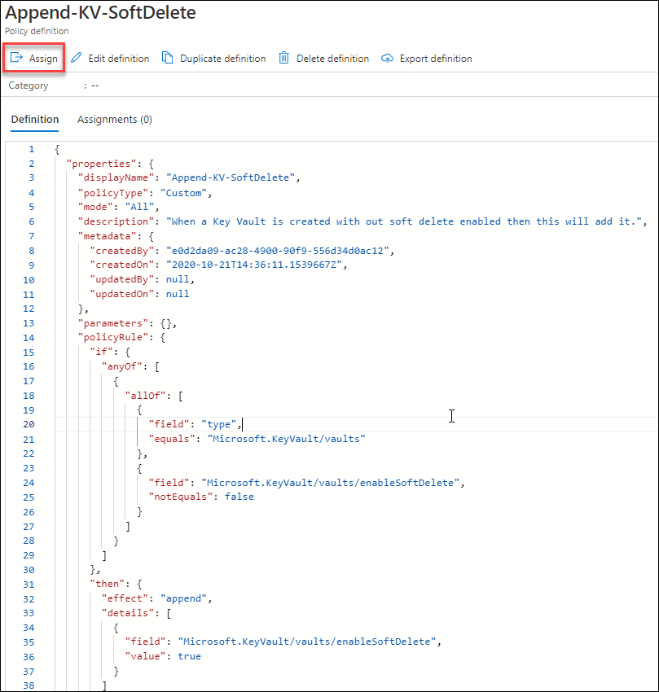

4. **Assign** the policy at the **Online** management group scope, and provide the assignment a description as **This policy will ensure all key vaults are being created with soft deletion enabled**.

  - Leave the other options default and Click on **Review+Create** for assignment to be successfully applied.
   
    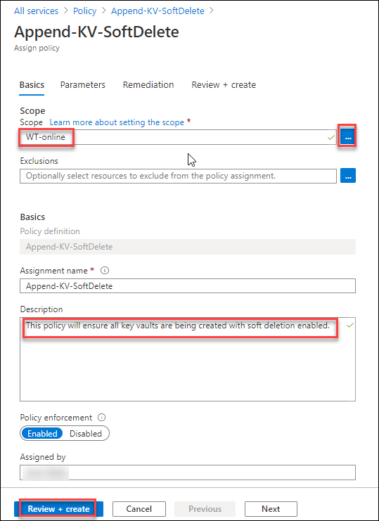

   In this exercise you deployed the Management Group structure using ARM template and Policy Set definitions and learnt about the Enterprise scale landing zone

   Click on **Next** to proceed for the next exercise.
