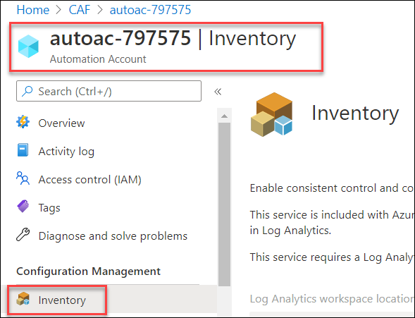
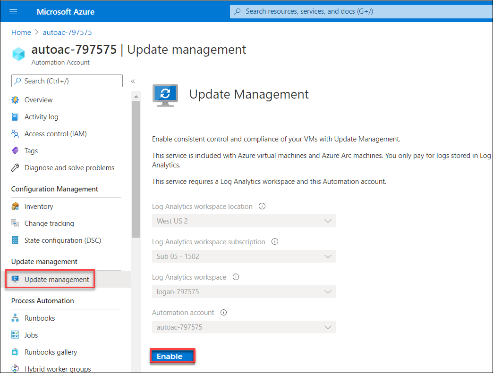
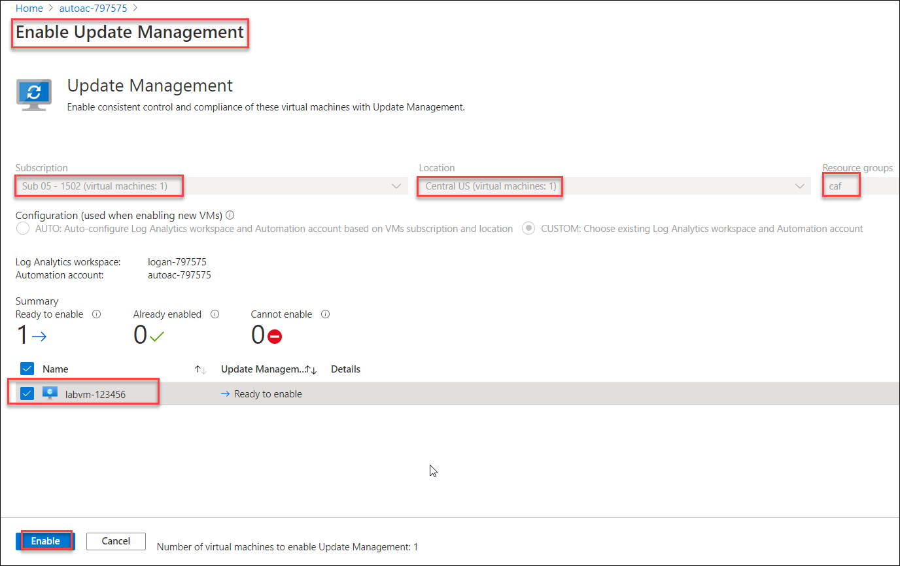
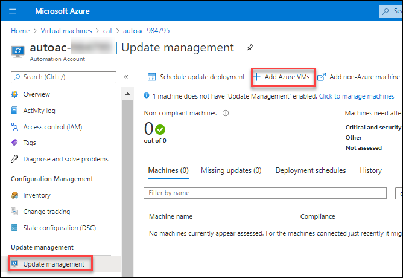
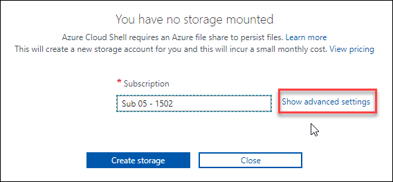
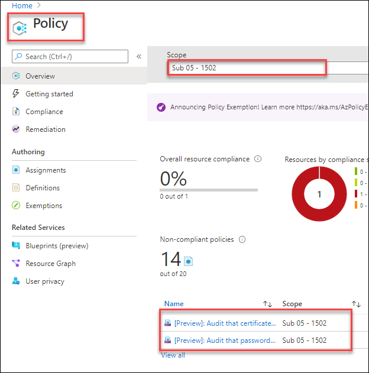

# Exercise 4: Azure Server Management Services

## Overview
Azure server management services provide a consistent experience for managing servers at scale. These services cover both Linux and Windows operating systems. They can be used in production, development, and test environments. The server management services can support Azure IaaS virtual machines, physical servers, and virtual machines that are hosted on-premises or in other hosting environments.

In this exercise you will cover how to Onboard Change Tracking,Inventory, and Update Management solutions to Azure virtual machine

>Note: To onboard the server management services Azure **Update Management,Change Tracking and Inventory** ,**log analytics workspace, automation account and virtual machine**  are required and these are already provided as pre-requisite in the environment.

#### Task 1: Enable server management services on a Virtual Machine

In this task you will enable all service management services Change Tracking,Inventory and Update Management on a virtual machine.

#### Subtask1: Enable Change Tracking and Inventory on a Virtual Machine

Azure **Change Tracking and Inventory** provide alerts on the configuration state of your hybrid environment and changes to that environment. It can report critical file, service, software, and registry changes that might affect your deployed servers.By default, the Azure Automation inventory service doesn't monitor files or registry settings. The solution does provide a list of registry keys that we recommend for monitoring.

A **Log Analytics workspace** is a unique environment for storing Azure Monitor log data. Each workspace has its own data repository and configuration. Data sources and solutions are configured to store their data in particular workspaces. Azure monitoring solutions require all servers to be connected to a workspace, so that their log data can be stored and accessed.

The management services require an **Azure Automation account**. You use this account, and the capabilities of Azure Automation, to integrate Azure services and other public systems to deploy, configure, and manage your server management processes.

In this section you will enable consistent control and compliance of your VMs with Change Tracking and Inventory.

1. In the upper left corner of the portal window, to open the Resource Groups menu, click the toggle menu icon and then click on **Resource groups**.
    
   
    
    This blade displays all of the resource groups that you have access to the Azure subscriptions.

2. Now select **CAF** resource group under the list of Resource groups and then select automation account **autoac-DeploymentID**
   
   

3. On the **Automation account** blade then click on **Inventory**.

   
   
4. Choose the Log Analytics workspace**logan-DeploymentID** and Automation account **autoac-DeploymentID**  and click on **Enable** to enable Change Tracking and Inventory. 

   
  
5. From the **Automation account|Inventory** blade click on **+Add Azure VMs**,this will open up a new page **Enable Inventory**
   
   

6. On the **Enable Inventory** page choose the subscription **Sub 05** and resource group **CAF** then select the virtual machine **labvm-DeploymentID** and click on **Enable** to add the virtual machine to log analytics workspace and also enable Change Tracking and Inventory on a Virtual Machine.
   
   
   
  > Note: If you enable Inventory, change tracking will also be enabled.

7. After adding the Virtual machine to Inventory it should show under **Machines** tab.

  
   
   >It may take some time for the virtual machine to be reflected under **Machines** tab,You can continue with the lab.

8. From the **Automation account| Inventory** blade Click on **Edit Settings** this will redirect you to **Workspace Configuration** page

   

9. On the **Workspace Configuration** page under the **Windows Registry** review the **Registry keys** available.
   
   
   
##### Subtask2: Enable Update Management on a Virtual machine

You can use Update Management in Azure Automation to manage operating system updates for your Windows and Linux machines in Azure, in on-premises environments, and in other cloud environments. 

1. Navigate to Automation account and under the **Update management** section and then select **Update management**.
 
   

2. Now choose the Log Analytics workspace**logan-DeploymentID** and Automation account **autoac-DeploymentID** and click on **Enable** to enable update management.

   





##### Subtask3:Configure file tracking on Windows
When you add a new file or registry key to track, Azure Automation enables it for Change Tracking and Inventory.You can use Change Tracking and Inventory to track changes to files and folders/directories. 

#### Task 2: Guest Configuration Policy 

In this task you will use the Azure Policy Guest Configuration extension to audit the configuration settings in a virtual machine to verify that password security settings in Windows and Linux computers are set correctly and also to check whether any certificates are about to expire.
Use the PowerShell commands to deploy these policies to:
- Verify that password security settings in Windows and Linux computers are set correctly.
- Verify that certificates aren't close to expiration on Windows VMs.

1. In the Azure portal, open the **Azure Cloud Shell** by clicking on the icon in the top right of the Azure Portal.
   
   
   
2. If prompted to select either Bash or PowerShell, select **PowerShell**.

3. Click on **show advanced settings**.

   
   
4. In **advanced settings**, select the subscription **Sub 05-DeploymentID** and region **CentralUS** 
   
   
   
   Then select **CAF** resource group and choose the **existing storage account**,create a file share and click on **Create Storage**.

5. Ensure you are connected to **Powershell Session**
   
   
   
6. Connect to your azure account by running the command:
   ```
   Connect-AzAccount 
    ```
7. Set the subscription that you want to apply the policies to by running the below command:
   
   ```
   $Subscription = Get-AzSubscription | Where-Object { $_.Name -like "*sub 05*"  } | Sort-Object -Property Name
   $scope = "/subscriptions/" + $Subscription.Id
   ```

8. Assign the available policy definition **Verify that password security settings in Windows and Linux computers are set correctly** by running the below command:
   ```
   $PasswordPolicy = Get-AzPolicySetDefinition -Name "3fa7cbf5-c0a4-4a59-85a5-cca4d996d5a6"
   New-AzPolicyAssignment -Name "PasswordPolicy" -DisplayName "[Preview]: Audit that password security settings are set correctly inside Linux and Windows machines" -Scope     $scope -PolicySetDefinition $PasswordPolicy -AssignIdentity -Location centralus
   ```

 9. Assign the available policy definition **Verify that certificates aren't close to expiration on Windows VMs** by running the below command:
    ```
    $CertExpirePolicy = Get-AzPolicySetDefinition -Name "b6f5e05c-0aaa-4337-8dd4-357c399d12ae"
    New-AzPolicyAssignment -Name "CertExpirePolicy" -DisplayName "[Preview]: Audit that certificates are not expiring on Windows VMs" -Scope $scope -PolicySetDefinition     $CertExpirePolicy -AssignIdentity -Location centralus
    ```
10. From the Azure portal , type **policy** at the search bar and select **Policy** under services. You will be redirected to **Policy** page.
   
   

11. On the **Policy** page select the scope as **sub 05-DeploymentID** and verify the policies assigned in the previous steps.

   
   
#### Task 3: Create Update Schedules 

Schedule the installation of updates to ensure that all your servers have the latest ones.You can quickly assess the status of available updates on all agent machines and manage the process of installing required updates for servers.
In this task you will schedule update on a virtual machine.

#### Task 4: Enable Tracking and Alerting for Critical Changes

Azure Change Tracking and Inventory provide alerts on the configuration state of your hybrid environment and changes to that environment. It can report critical file, service, software, and registry changes that might affect your deployed servers.

By default, the Azure Automation inventory service doesn't monitor files or registry settings. The solution does provide a list of registry keys that we recommend for monitoring.

1.	Set Alerts on file or registry changes in the VM.

After the query returns the results, select New alert rule to open the alert-rule editor. You can also get to this editor via Azure Monitor in the Azure portal.
