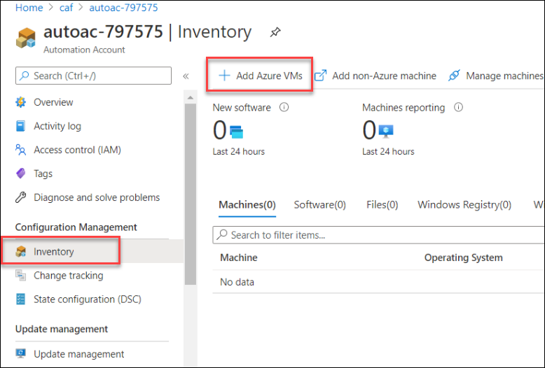

# Exercise 4: Azure Server Management Services

Azure server management services provide a consistent experience for managing servers at scale. These services cover both Linux and Windows operating systems. They can be used in production, development, and test environments. The server management services can support Azure IaaS virtual machines, physical servers, and virtual machines that are hosted on-premises or in other hosting environments.

#### Task 1: Enable server management services on a VM

#### Onboard Change Tracking,Inventory, and Update Management solutions to Azure virtual machine

Azure **Change Tracking and Inventory** provide alerts on the configuration state of your hybrid environment and changes to that environment. It can report critical file, service, software, and registry changes that might affect your deployed servers.By default, the Azure Automation inventory service doesn't monitor files or registry settings. The solution does provide a list of registry keys that we recommend for monitoring.

A **Log Analytics workspace** is a unique environment for storing Azure Monitor log data. Each workspace has its own data repository and configuration. Data sources and solutions are configured to store their data in particular workspaces. Azure monitoring solutions require all servers to be connected to a workspace, so that their log data can be stored and accessed.

Some of the management services require an **Azure Automation account**. You use this account, and the capabilities of Azure Automation, to integrate Azure services and other public systems to deploy, configure, and manage your server management processes.

>Note: To onboard the server management services Azure **Update Management,Change Tracking and Inventory** ,**log analytics workspace, automation account and virtual machine**  are required and these are already provided as pre-requisite in the environment.

#### Enable Change Tracking and Inventory 

In this task you will enable consistent control and compliance of your VMs with Change Tracking and Inventory.

1. In the upper left corner of the portal window, to open the Resource Groups menu, click the toggle menu icon and then click on **Resource groups**.
    
   
    
    This blade displays all of the resource groups that you have access to the Azure subscriptions.

2. Now select **CAF** resource group under the list of Resource groups and then select automation account **autoac-DeploymentID**
   
   

3. On the **Automation account** blade then click on **Inventory**.

   
   
4. Choose the Log Analytics workspace**logan-DeploymentID** and Automation account **autoac-DeploymentID**  and click on **Enable** to enable Change Tracking and Inventory. 

  >The setup takes up to 10 minutes to complete.

   
   
#### Enable Azure VMs

1. From the **Automation account|Inventory** blade click on **+Add Azure VMs**,this will open up a new page **Enable Change Tracking**
   
   

2. On the **Enable Change Tracking** page choose the subscription **Sub 05** and resource group **CAF** then select the virtual machine **labvm-DeploymentID** and click on **Enable** to add the virtual machine to log analytics workspace.
   
   
   
3. 

4. From the **Automation account|Inventory** blade Click on **Edit Settings** this will redirect you to **Workspace Configuration** page

   

5.  On the **Workspace Configuration** page under the **Windows Registry** review the **Registry keys** available.


#### Task 2: Create Update Schedules 

Schedule the installation of updates to ensure that all your servers have the latest ones.
You can use Update Management in Azure Automation to manage operating system updates for your Windows and Linux machines in Azure, in on-premises environments, and in other cloud environments. 
You can quickly assess the status of available updates on all agent machines and manage the process of installing required updates for servers.

#### Task 3: Guest Configuration Policy 

In this task you will use the Azure Policy Guest Configuration extension to audit the configuration settings in a virtual machine to verify that password security settings in Windows and Linux computers are set correctly and also to check whether any certificates are about to expire.

1. From the **Azure portal** open the cloud shell session.

2. Select the powershell session 

3. Connect to your azure account by running the command:
   ```
   Connect-AzAccount 
    ```
4. Set the subscription to be used by running the below command:
   
   ```
   $Subscription = Get-AzSubscription | Where-Object { $_.Name -like "*sub 05*"  } | Sort-Object -Property Name
   $scope = "/subscriptions/" + $Subscription.Id
   ```

5. Verify that password security settings in Windows and Linux computers are set correctly.
   ```
   $PasswordPolicy = Get-AzPolicySetDefinition -Name "3fa7cbf5-c0a4-4a59-85a5-cca4d996d5a6"
   New-AzPolicyAssignment -Name "PasswordPolicy" -DisplayName "[Preview]: Audit that password security settings are set correctly inside Linux and Windows machines" -Scope     $scope -PolicySetDefinition $PasswordPolicy -AssignIdentity -Location centralus
   ```

 6. Verify that certificates aren't close to expiration on Windows VMs.
    ```
    $CertExpirePolicy = Get-AzPolicySetDefinition -Name "b6f5e05c-0aaa-4337-8dd4-357c399d12ae"
    New-AzPolicyAssignment -Name "CertExpirePolicy" -DisplayName "[Preview]: Audit that certificates are not expiring on Windows VMs" -Scope $scope -PolicySetDefinition     $CertExpirePolicy -AssignIdentity -Location centralus
    ```

#### Task 4: Enable Tracking and Alerting for Critical Changes

Azure Change Tracking and Inventory provide alerts on the configuration state of your hybrid environment and changes to that environment. It can report critical file, service, software, and registry changes that might affect your deployed servers.

By default, the Azure Automation inventory service doesn't monitor files or registry settings. The solution does provide a list of registry keys that we recommend for monitoring.

1.	Set Alerts on file or registry changes in the VM.

After the query returns the results, select New alert rule to open the alert-rule editor. You can also get to this editor via Azure Monitor in the Azure portal.
